# Plan de Desarrollo: Adaptación de field_method_renaming a CSV Enhanced

## 🎯 Objetivo
Adaptar la herramienta field_method_renaming para utilizar exclusivamente la nueva estructura CSV enhanced, con comportamiento de rollback automático en caso de error y sin generación de reportes JSON.

## 📋 Plan de Implementación Detallado

### Fase 1: Actualizar CSVReader y FieldChange (2 días)

**1.1 Extender FieldChange existente con nuevos campos:**
```python
# utils/csv_reader.py - Actualizar clase existente
@dataclass
class FieldChange:
    """Representa un cambio de campo o método con información completa de contexto"""

    # Campos existentes
    old_name: str
    new_name: str
    module: str
    model: str
    change_type: str  # 'field' o 'method'

    # NUEVOS campos del CSV enhanced
    change_id: str = ""
    change_scope: str = "declaration"
    impact_type: str = "primary"
    context: str = ""
    confidence: float = 0.0
    parent_change_id: str = ""
    validation_status: str = "pending"

    # Campos para tracking interno
    applied: bool = False
    error_message: str = ""

    def can_be_applied(self) -> bool:
        """Verifica si este cambio puede ser aplicado"""
        return (
            self.validation_status in ["approved", "auto_approved"]
            and not self.applied
        )

    def is_primary(self) -> bool:
        """Verifica si es un cambio primario (declaración)"""
        return self.impact_type == "primary"

    def is_extension_declaration(self) -> bool:
        """Verifica si es una declaración en módulo de extensión"""
        return (
            self.impact_type == "inheritance"
            and self.change_scope == "declaration"
        )

    def is_field(self) -> bool:
        """Verifica si el cambio es para un campo"""
        return self.change_type == "field"

    def is_method(self) -> bool:
        """Verifica si el cambio es para un método"""
        return self.change_type == "method"
        
    def __str__(self):
        base = f"{self.old_name} → {self.new_name} ({self.module}.{self.model})"
        if self.context:
            base += f" in {self.context}"
        return f"[{self.change_id}] {base}"
```

**1.2 Actualizar CSVReader (eliminar ~180 líneas redundantes):**
```python
class CSVReader:
    """Reader para archivos CSV con estructura enhanced"""
    
    REQUIRED_HEADERS = [
        "change_id", "old_name", "new_name", "item_type", "module", "model",
        "change_scope", "impact_type", "context", "confidence", 
        "parent_change_id", "validation_status"
    ]
    
    def load_changes(self) -> list[FieldChange]:
        """Carga solo cambios aprobados del CSV enhanced"""
        # ... código existente para abrir archivo ...
        
        changes = []
        for row_num, row in enumerate(reader, start=2):
            cleaned_row = self._clean_csv_row(row)
            self._validate_csv_row(cleaned_row, row_num)
            
            change = FieldChange(
                # Campos existentes
                old_name=cleaned_row["old_name"],
                new_name=cleaned_row["new_name"],
                module=cleaned_row["module"],
                model=cleaned_row["model"],
                change_type=cleaned_row["item_type"],
                
                # Nuevos campos
                change_id=cleaned_row["change_id"],
                change_scope=cleaned_row["change_scope"],
                impact_type=cleaned_row["impact_type"],
                context=cleaned_row.get("context", ""),
                confidence=float(cleaned_row["confidence"]),
                parent_change_id=cleaned_row.get("parent_change_id", ""),
                validation_status=cleaned_row["validation_status"]
            )
            
            # Solo añadir si puede ser aplicado
            if change.can_be_applied():
                changes.append(change)
                
        logger.info(f"Loaded {len(changes)} approved changes from {self.csv_file_path}")
        return changes
    
    # ELIMINAR estos métodos redundantes:
    # - group_by_module() 
    # - group_by_model()  
    # - filter_by_module() 
    # - filter_by_change_type()
    # - validate_csv_integrity()
    # - get_statistics() [solo se usa para reportes]
```

### Fase 2: Sistema de Agrupación Jerárquica con Rollback (2 días)

**2.1 Crear clase ChangeGroup con soporte para rollback:**
```python
# utils/change_grouper.py - NUEVO archivo
from dataclasses import dataclass, field
from typing import List, Dict, Tuple
from pathlib import Path

@dataclass
class ChangeGroup:
    """Agrupa cambios relacionados con tracking para rollback"""

    primary: FieldChange
    references: List[FieldChange]
    extension_declarations: List[FieldChange] = field(default_factory=list)  # NUEVO
    # Tracking de cambios aplicados para rollback
    applied_changes: List[Tuple[Path, FieldChange]] = field(default_factory=list)

    def get_changes_for_file(self, file_path: Path) -> List[FieldChange]:
        """Retorna solo cambios relevantes para un archivo específico"""
        relevant = []

        is_python = file_path.suffix == '.py'
        is_xml = file_path.suffix == '.xml'

        # Incluir cambio primario si corresponde
        if is_python and self._is_model_file(file_path, self.primary):
            relevant.append(self.primary)

        # Incluir declaraciones de extensión del mismo modelo
        for ext_decl in self.extension_declarations:
            if is_python and self._is_model_file(file_path, ext_decl):
                relevant.append(ext_decl)

        # Incluir referencias según contexto
        for ref in self.references:
            if self._should_apply_to_file(ref, file_path, is_python, is_xml):
                relevant.append(ref)

        return relevant
    
    def track_applied(self, file_path: Path, change: FieldChange):
        """Registra un cambio aplicado exitosamente"""
        self.applied_changes.append((file_path, change))
        change.applied = True
        
    def get_rollback_files(self) -> List[Path]:
        """Obtiene lista de archivos únicos que necesitan rollback"""
        return list(set(path for path, _ in self.applied_changes))

def group_changes_hierarchically(changes: List[FieldChange]) -> Dict[str, ChangeGroup]:
    """Agrupa cambios por relación padre-hijo considerando modelos de extensión"""
    groups = {}

    # Separar por tipo
    primaries = [c for c in changes if c.is_primary()]
    extension_decls = [c for c in changes if c.is_extension_declaration()]
    other_references = [
        c for c in changes
        if not c.is_primary() and not c.is_extension_declaration()
    ]

    # Crear grupos para cada cambio primario
    for primary in primaries:
        # Encontrar declaraciones de extensión de este primario
        primary_extensions = [
            ext for ext in extension_decls
            if ext.parent_change_id == primary.change_id
        ]

        # Encontrar todas las referencias de este primario
        primary_refs = [
            ref for ref in other_references
            if ref.parent_change_id == primary.change_id
        ]

        groups[primary.change_id] = ChangeGroup(
            primary=primary,
            references=primary_refs,
            extension_declarations=primary_extensions  # NUEVO
        )

    # Agregar referencias huérfanas como grupos individuales
    orphan_refs = [
        ref for ref in other_references
        if ref.parent_change_id not in groups
    ]

    for orphan in orphan_refs:
        groups[orphan.change_id] = ChangeGroup(
            primary=orphan,
            references=[],
            extension_declarations=[]
        )

    return groups
```

### Fase 3: BaseProcessor con Rollback Automático (3 días)

**3.1 Actualizar BaseProcessor para rollback automático:**
```python
# processors/base_processor.py

class ProcessResult:
    # Añadir campo para tracking de rollback
    rollback_performed: bool = False
    
    # ELIMINAR: Código relacionado con estadísticas para reporte
    # def get_processing_stats() - líneas 414-442

class BaseProcessor(ABC):
    """Procesador base con rollback automático en caso de error"""
    
    def process_file(self, file_path: Path, changes: list[FieldChange]) -> ProcessResult:
        """Procesa archivo con rollback automático si falla algún cambio"""
        
        logger.debug(f"Processing {file_path} with {len(changes)} changes")
        
        # Leer contenido original
        try:
            original_content = self._read_file_content(file_path)
            
            if self.validate_syntax and not self._validate_original_syntax(file_path, original_content):
                return ProcessResult(
                    file_path=file_path,
                    status=ProcessingStatus.SKIPPED,
                    changes_applied=0,
                    changes_details=[],
                    error_message="Original file has syntax errors"
                )
        except Exception as e:
            return ProcessResult(
                file_path=file_path,
                status=ProcessingStatus.ERROR,
                changes_applied=0,
                changes_details=[],
                error_message=f"Cannot read file: {str(e)}"
            )
        
        # Crear backup SIEMPRE (para rollback)
        backup_path = self._create_backup(file_path, original_content)
        
        # Aplicar cambios con tracking
        applied_changes = []
        modified_content = original_content
        error_occurred = False
        error_message = None
        
        for change in changes:
            try:
                # Aplicar cambio individual
                new_content, change_details = self._apply_single_change(
                    file_path, modified_content, change
                )
                
                # Validar sintaxis inmediatamente
                if self.validate_syntax and not self._validate_syntax(file_path, new_content):
                    raise SyntaxValidationError(
                        f"Syntax error after applying {change.old_name} → {change.new_name}"
                    )
                
                modified_content = new_content
                applied_changes.extend(change_details)
                change.applied = True
                
                logger.debug(f"Applied change {change.change_id}: {change}")
                
            except Exception as e:
                # Error en cambio - activar rollback
                error_occurred = True
                error_message = (f"Failed to apply change {change.change_id} "
                               f"({change.old_name} → {change.new_name}): {str(e)}")
                
                logger.error(error_message)
                change.error_message = str(e)
                
                # IMPORTANTE: Parar inmediatamente (comportamiento por defecto)
                break
        
        # Si hubo error, hacer rollback
        if error_occurred:
            logger.warning(f"Rolling back all changes in {file_path} due to error")
            
            # Restaurar contenido original
            try:
                self._write_file_content(file_path, original_content)
                logger.info(f"Rollback successful for {file_path}")
                
                return ProcessResult(
                    file_path=file_path,
                    status=ProcessingStatus.ERROR,
                    changes_applied=0,  # 0 porque hicimos rollback
                    changes_details=[],
                    error_message=error_message,
                    backup_path=backup_path,
                    rollback_performed=True
                )
                
            except Exception as rollback_error:
                # Error crítico en rollback
                logger.error(f"CRITICAL: Rollback failed for {file_path}: {rollback_error}")
                return ProcessResult(
                    file_path=file_path,
                    status=ProcessingStatus.ERROR,
                    changes_applied=len(applied_changes),
                    changes_details=applied_changes,
                    error_message=f"Original error: {error_message}. Rollback failed: {rollback_error}",
                    backup_path=backup_path,
                    rollback_performed=False
                )
        
        # Sin errores - escribir cambios si hubo alguno
        if applied_changes and modified_content != original_content:
            try:
                self._write_file_content(file_path, modified_content)
            except Exception as e:
                # Error al escribir - intentar rollback
                logger.error(f"Failed to write changes: {e}. Attempting rollback...")
                
                try:
                    self._write_file_content(file_path, original_content)
                    return ProcessResult(
                        file_path=file_path,
                        status=ProcessingStatus.ERROR,
                        changes_applied=0,
                        changes_details=[],
                        error_message=f"Write failed: {e}",
                        backup_path=backup_path,
                        rollback_performed=True
                    )
                except:
                    # Rollback falló - estado crítico
                    return ProcessResult(
                        file_path=file_path,
                        status=ProcessingStatus.ERROR,
                        changes_applied=0,
                        changes_details=[],
                        error_message=f"CRITICAL: Write and rollback failed: {e}",
                        backup_path=backup_path,
                        rollback_performed=False
                    )
        
        # Éxito completo
        return ProcessResult(
            file_path=file_path,
            status=ProcessingStatus.SUCCESS if applied_changes else ProcessingStatus.NO_CHANGES,
            changes_applied=len(applied_changes),
            changes_details=applied_changes,
            backup_path=backup_path,
            original_content=original_content,
            modified_content=modified_content if applied_changes else None
        )
    
    # Nuevo método abstracto
    @abstractmethod
    def _apply_single_change(
        self, file_path: Path, content: str, change: FieldChange
    ) -> tuple[str, list[str]]:
        """Aplica un cambio individual considerando su contexto"""
        pass
```

**3.2 Actualizar PythonProcessor con contexto:**
```python
# processors/python_processor.py

def _apply_single_change(
    self, file_path: Path, content: str, change: FieldChange
) -> tuple[str, list[str]]:
    """Aplica un cambio considerando su contexto específico y tipo de impacto"""

    # Para declaraciones - distinguir entre primarias y de extensión
    if change.change_scope == "declaration":
        if change.is_extension_declaration():
            # Declaración en módulo de extensión - buscar y reemplazar
            # la redefinición del campo/método en el módulo de extensión
            return self._apply_extension_declaration_change(content, change)
        else:
            # Declaración primaria en módulo base
            return self._apply_declaration_change(content, change)

    # Para referencias (change_scope == "reference")
    elif change.change_scope == "reference":
        return self._apply_reference_change(content, change)

    # Para llamadas a métodos
    elif change.change_scope == "call":
        return self._apply_method_call_change(content, change)

    # Para super calls
    elif change.change_scope == "super_call":
        return self._apply_super_call_change(content, change)

    else:
        # Fallback al comportamiento anterior
        return self._apply_changes(file_path, content, [change])

def _apply_extension_declaration_change(self, content: str, change: FieldChange) -> tuple[str, list[str]]:
    """Aplica cambio a una declaración en módulo de extensión"""

    try:
        tree = ast.parse(content)
    except SyntaxError as e:
        raise ProcessingError(f"Cannot parse Python file: {e}")

    # El transformer debe buscar la clase que extiende el modelo
    # y cambiar el nombre del campo/método en esa clase específica
    transformer = ExtensionAwareTransformer(
        model_name=change.model,
        module_name=change.module,
        field_changes={change.old_name: change.new_name} if change.is_field() else {},
        method_changes={change.old_name: change.new_name} if change.is_method() else {},
        is_extension=True
    )

    modified_tree = transformer.visit(tree)

    if not transformer.changes_applied:
        raise ProcessingError(
            f"Could not find extension declaration of {change.change_type} "
            f"'{change.old_name}' in module '{change.module}' for model '{change.model}'"
        )

    return ast.unparse(modified_tree), transformer.changes_applied

def _apply_reference_change(self, content: str, change: FieldChange) -> tuple[str, list[str]]:
    """Aplica cambio a referencias usando contexto"""
    
    try:
        tree = ast.parse(content)
    except SyntaxError as e:
        raise ProcessingError(f"Cannot parse Python file: {e}")
    
    # Crear transformer que considere el contexto
    transformer = ContextAwareTransformer(
        field_changes={change.old_name: change.new_name} if change.is_field else {},
        method_changes={change.old_name: change.new_name} if change.is_method else {},
        target_context=change.context  # NUEVO: pasar contexto
    )
    
    modified_tree = transformer.visit(tree)
    
    if not transformer.changes_applied:
        raise ProcessingError(
            f"Could not find {change.change_type} '{change.old_name}' "
            f"in context '{change.context or 'any'}'"
        )
    
    return ast.unparse(modified_tree), transformer.changes_applied

# Actualizar ASTFieldMethodTransformer para considerar contexto
class ContextAwareTransformer(ASTFieldMethodTransformer):
    def __init__(self, field_changes, method_changes, target_context=None):
        super().__init__(field_changes, method_changes)
        self.target_context = target_context
        self.current_context = []  # Stack de contextos
        
    def visit_FunctionDef(self, node):
        # Rastrear contexto actual
        self.current_context.append(node.name)
        result = super().visit_FunctionDef(node)
        self.current_context.pop()
        return result
        
    def should_apply_change(self, name):
        """Verifica si debe aplicar el cambio en el contexto actual"""
        if not self.target_context:
            return True  # Sin contexto específico, aplicar en todos lados
            
        current = ".".join(self.current_context) if self.current_context else ""
        return self.target_context == current
```

### Fase 4: Simplificar Flujo Principal (2 días)

**4.1 Actualizar apply_field_method_changes.py (sin generación de reportes):**
```python
class FieldMethodRenamer:
    """Aplicador de cambios con rollback automático"""
    
    def __init__(self, config):
        self.config = config
        self.stats = {
            "total_groups": 0,
            "total_changes": 0,
            "applied_changes": 0,
            "failed_changes": 0,
            "rollback_files": 0
        }
        # ELIMINAR: self.processing_report y todo código relacionado
        
    def run(self) -> int:
        try:
            # 1. Cargar cambios aprobados
            csv_reader = CSVReader(self.config.csv_file)
            all_changes = csv_reader.load_changes()
            
            if not all_changes:
                print("ℹ️  No approved changes found in CSV")
                return 0
            
            # 2. Agrupar por jerarquía
            from utils.change_grouper import group_changes_hierarchically
            change_groups = group_changes_hierarchically(all_changes)
            
            self.stats["total_groups"] = len(change_groups)
            self.stats["total_changes"] = len(all_changes)
            
            print(f"\n📊 Processing {len(change_groups)} change groups "
                  f"with {len(all_changes)} total changes...")
            
            # 3. Procesar cada grupo
            all_results = []
            for group_id, change_group in change_groups.items():
                print(f"\n🔄 Processing group {group_id}: "
                      f"{change_group.primary.old_name} → {change_group.primary.new_name}")
                
                group_results = self._process_change_group(change_group)
                all_results.extend(group_results)
                
                # ELIMINAR: Registro en self.processing_report
            
            # 4. Mostrar resumen en consola
            self._display_summary(all_results)
            
            # ELIMINAR: self._save_processing_report()
            # ELIMINAR: self._generate_report()
            
            # Retornar código de salida
            return 0 if self.stats["failed_changes"] == 0 else 1
            
        except KeyboardInterrupt:
            print("\n⚠️  Process interrupted by user")
            return 130
        except Exception as e:
            logger.exception("Fatal error during processing")
            print(f"\n❌ Fatal error: {e}")
            return 1
            
    def _process_change_group(self, change_group: ChangeGroup) -> list[ProcessResult]:
        """Procesa grupo con rollback completo si falla cualquier archivo

        IMPORTANTE: Para modelos de extensión, procesar en orden:
        1. Cambio primario (módulo base)
        2. Declaraciones de extensión (módulos que extienden)
        3. Referencias y llamadas
        """

        # Ordenar archivos por prioridad (base primero, extensiones después)
        affected_files = self._find_affected_files_ordered(change_group)
        results = []
        group_has_error = False

        for file_path in affected_files:
            # Obtener cambios para este archivo
            file_changes = change_group.get_changes_for_file(file_path)
            if not file_changes:
                continue

            # Log detallado para declaraciones de extensión
            for change in file_changes:
                if change.is_extension_declaration():
                    logger.info(f"Processing extension declaration in {change.module}: "
                              f"{change.old_name} → {change.new_name}")

            # Procesar archivo
            processor = self._get_processor_for_file(file_path)
            if processor:
                result = processor.process_file(file_path, file_changes)
                results.append(result)

                # Si hubo error, marcar el grupo
                if result.status == ProcessingStatus.ERROR:
                    group_has_error = True
                    logger.error(f"Error in group {change_group.primary.change_id}: "
                               f"{result.error_message}")

                    # El rollback ya se hizo en BaseProcessor
                    if result.rollback_performed:
                        self.stats["rollback_files"] += 1

                    # IMPORTANTE: Si falla en módulo base o extensión,
                    # no procesar referencias para evitar inconsistencias
                    if change_group.primary in file_changes or \
                       any(c.is_extension_declaration() for c in file_changes):
                        logger.warning("Skipping remaining files due to base/extension failure")
                        break
                    
                # Actualizar estadísticas si fue exitoso
                elif result.is_success:
                    self.stats["applied_changes"] += result.changes_applied
                    # Registrar cambios aplicados en el grupo
                    for change in file_changes:
                        if change.applied:
                            change_group.track_applied(file_path, change)
        
        # Si el grupo tuvo error, incrementar contador
        if group_has_error:
            self.stats["failed_changes"] += 1
            
        return results
        
    def _display_summary(self, results: list[ProcessResult]):
        """Muestra resumen en consola sin generar reportes"""
        
        successful = len([r for r in results if r.is_success])
        failed = len([r for r in results if r.status == ProcessingStatus.ERROR])
        rollbacks = len([r for r in results if r.rollback_performed])
        
        print(f"""
╔══════════════════════════════════════════════════════════════════╗
║                      Processing Summary                          ║
╚══════════════════════════════════════════════════════════════════╝

📊 Results:
   ✅ Successful files: {successful}
   ❌ Failed files: {failed}
   🔄 Files rolled back: {rollbacks}
   
   📝 Total changes applied: {self.stats['applied_changes']}
   📝 Total changes failed: {self.stats['failed_changes']}
        """)
        
        # Si hubo errores, mostrar detalles
        if failed > 0:
            print("\n⚠️  Errors occurred during processing:")
            for result in results:
                if result.status == ProcessingStatus.ERROR:
                    print(f"   ❌ {result.file_path}: {result.error_message}")
                    if result.rollback_performed:
                        print(f"      ↩️  Changes rolled back successfully")
                    else:
                        print(f"      ⚠️  ROLLBACK FAILED - manual intervention required!")
                        
    # ELIMINAR estos métodos:
    # - _save_processing_report()
    # - _generate_report()
    # - _generate_json_report()
    # - _result_to_dict()
```

**4.2 Simplificar argumentos CLI:**
```python
def parse_arguments():
    parser = argparse.ArgumentParser(
        description="Apply field and method name changes from enhanced CSV"
    )
    
    # Argumentos esenciales
    parser.add_argument(
        "--csv-file", 
        required=True, 
        help="Path to enhanced CSV file with approved changes"
    )
    parser.add_argument(
        "--repo-path", 
        required=True, 
        help="Path to Odoo repository"
    )
    
    # Opciones de procesamiento
    parser.add_argument(
        "--dry-run",
        action="store_true",
        help="Show what would be changed without applying"
    )
    parser.add_argument(
        "--no-backup",
        action="store_true",
        help="Disable backup creation (NOT RECOMMENDED - disables rollback)"
    )
    
    # Opciones de output
    parser.add_argument(
        "--verbose", "-v",
        action="store_true",
        help="Enable verbose output"
    )
    
    # ELIMINADOS:
    # - --quiet (siempre mostrar información importante)
    # - --generate-report (ya no existe)
    # - --stop-on-error (siempre activo con rollback)
    # - --module (usa info del CSV)
    # - --file-types (determinado por impact_type)
    # - --interactive (usa validation_status)
    
    return parser.parse_args()
```

### Fase 5: Testing y Documentación (1 día)

**5.1 Tests para nueva funcionalidad:**
```python
# tests/test_csv_enhanced.py
def test_load_enhanced_csv():
    """Test carga de CSV con estructura enhanced"""
    
def test_hierarchical_grouping():
    """Test agrupación por parent_change_id"""
    
def test_context_aware_processing():
    """Test aplicación de cambios con contexto"""
    
def test_validation_status_filtering():
    """Test que solo se cargan cambios aprobados"""
    
# tests/test_rollback.py
def test_rollback_on_syntax_error():
    """Test que rollback ocurre si hay error de sintaxis"""
    
def test_rollback_on_apply_error():
    """Test rollback cuando no se puede aplicar un cambio"""
    
def test_partial_group_rollback():
    """Test que todo el grupo se detiene si falla un archivo"""
    
def test_rollback_tracking():
    """Test que el tracking de rollback funciona correctamente"""
```

## 📁 Estructura de Directorio Final

```
field_method_renaming/
├── __init__.py
├── apply_field_method_changes.py    # Script principal (simplificado, sin reportes)
│
├── config/
│   ├── __init__.py
│   └── renaming_settings.py         # Configuración (sin cambios)
│
├── utils/
│   ├── __init__.py
│   ├── csv_reader.py               # ACTUALIZADO: Nueva estructura CSV, -200+ líneas
│   ├── change_grouper.py           # NUEVO: Sistema jerárquico
│   ├── backup_manager.py           # Sin cambios (crítico para rollback)
│   └── file_finder.py              # Sin cambios
│
├── processors/
│   ├── __init__.py
│   ├── base_processor.py           # ACTUALIZADO: Rollback automático, sin stats
│   ├── python_processor.py         # ACTUALIZADO: Context-aware
│   └── xml_processor.py            # ACTUALIZADO: Context-aware
│
├── interactive/                    # ELIMINADO: No necesario (usa validation_status)
│
├── docs/
│   ├── README.md                   # ACTUALIZADO: Nueva estructura
│   ├── ARCHITECTURE.md             # ACTUALIZADO: Nuevo flujo
│   ├── CSV_ENHANCED_STRUCTURE_GUIDE.md  # Existente
│   └── USAGE.md                    # ACTUALIZADO: Ejemplos nuevos
│
└── tests/
    ├── test_csv_enhanced.py        # NUEVO: Tests para CSV enhanced
    ├── test_rollback.py            # NUEVO: Tests de rollback
    └── test_context_processing.py  # NUEVO: Tests de contexto

# ELIMINADOS:
# - field_renaming_report.json (ya no se genera)
# - Código para generar reportes JSON
```

## 🔄 Diagrama de Flujo Lógico

```mermaid
graph TD
    A[Inicio] --> B[Leer CSV Enhanced]
    B --> C{¿Hay cambios aprobados?}
    C -->|No| D[Fin - Sin cambios]
    C -->|Sí| E[Agrupar por parent_change_id]

    E --> E1[Separar: Primarios, Extensiones, Referencias]
    E1 --> F[Para cada grupo]
    F --> F1{¿Tiene extensiones?}

    F1 -->|Sí| G1[Ordenar: Base→Extensiones→Referencias]
    F1 -->|No| G2[Ordenar: Base→Referencias]

    G1 --> H[Para cada archivo ordenado]
    G2 --> H

    H --> H1{¿Es declaración extensión?}
    H1 -->|Sí| H2[Log: Procesando extensión]
    H1 -->|No| H3[Continuar]

    H2 --> I[Leer contenido original]
    H3 --> I
    I --> J[Crear backup]
    J --> K[Para cada cambio del archivo]

    K --> K1{¿Tipo de cambio?}
    K1 -->|Declaration + Primary| L1[Aplicar declaración base]
    K1 -->|Declaration + Inheritance| L2[Aplicar declaración extensión]
    K1 -->|Reference/Call| L3[Aplicar referencia/llamada]

    L1 --> M{¿Cambio exitoso?}
    L2 --> M
    L3 --> M

    M -->|Sí| N[Validar sintaxis]
    N --> O{¿Sintaxis OK?}

    O -->|Sí| P[Siguiente cambio]
    P --> K

    O -->|No| Q[ROLLBACK: Restaurar original]
    M -->|No| Q

    Q --> Q1{¿Es base o extensión?}
    Q1 -->|Sí| R1[Saltar referencias restantes]
    Q1 -->|No| R2[Marcar grupo fallido]

    R1 --> S[Log: Crítico - base/ext falló]
    R2 --> S2[Log error detallado]
    S --> T[Siguiente grupo]
    S2 --> T

    P --> U{¿Más cambios?}
    U -->|Sí| K
    U -->|No| V[Escribir archivo modificado]

    V --> W[Siguiente archivo]
    W --> H

    T --> F

    F --> X[Mostrar resumen en consola]
    X --> Y[Fin]

    style Q fill:#ff6666
    style R1 fill:#ff9999
    style R2 fill:#ff6666
    style S fill:#ff6666
    style S2 fill:#ff6666
    style J fill:#66ff66
    style X fill:#ffff66
    style L2 fill:#99ccff
    style H2 fill:#99ccff
```



### Explicación del Flujo:

1. **Entrada**: CSV enhanced con cambios aprobados/auto-aprobados
2. **Agrupación Jerárquica**: Por `parent_change_id` considerando:
   - Cambio primario (módulo base)
   - Declaraciones de extensión (módulos que extienden con `_inherit = _name`)
   - Referencias y llamadas en otros módulos
3. **Procesamiento por Grupo (Orden Crítico)**:
   - **Primero**: Cambio primario en módulo base
   - **Segundo**: Declaraciones en módulos de extensión
   - **Tercero**: Referencias y llamadas
   - Si falla módulo base o extensión, no procesar referencias (evita inconsistencias)
4. **Procesamiento por Archivo**:
   - Backup obligatorio antes de cualquier cambio
   - Aplicación secuencial de cambios con validación inmediata
   - Rollback automático si falla cualquier cambio
5. **Contexto**: Cada cambio se aplica considerando:
   - `change_scope`: declaration (base o extensión), reference, call, super_call
   - `impact_type`: primary, inheritance, cross_model, etc.
   - `context`: método/función específica donde aplicar
6. **Salida**: Solo resumen en consola (sin reporte JSON)

### Ejemplo de Procesamiento de Modelo de Extensión:

```python
# CSV de entrada (simplificado):
"""
change_id,old_name,new_name,module,model,change_scope,impact_type
100,order_line,order_line_ids,sale,sale.order,declaration,primary
101,order_line,order_line_ids,sale_stock,sale.order,declaration,inheritance
102,order_line,order_line_ids,sale_margin,sale.order,declaration,inheritance
150,order_line,order_line_ids,sale,sale.order,reference,self_reference
"""

# Proceso:
1. Grupo creado: primario=100, extensiones=[101,102], referencias=[150]

2. Orden de procesamiento:
   a) /sale/models/sale_order.py (cambio 100 - primario)
   b) /sale_stock/models/sale_order.py (cambio 101 - extensión)
   c) /sale_margin/models/sale_order.py (cambio 102 - extensión)
   d) /sale/models/sale_order.py (cambio 150 - referencia)

3. Si falla (a), no procesar b,c,d
4. Si falla (b) o (c), no procesar d
5. Si falla (d), ya se aplicaron a,b,c exitosamente
```

## 📊 Código Eliminado en la Limpieza

### **Total estimado: ~500-600 líneas eliminadas**

1. **CSVReader (~200 líneas)**:
   - `group_by_module()`: ~28 líneas
   - `group_by_model()`: ~28 líneas
   - `filter_by_module()`: ~24 líneas
   - `filter_by_change_type()`: ~26 líneas
   - `validate_csv_integrity()`: ~67 líneas
   - `get_statistics()`: ~32 líneas

2. **BaseProcessor (~30 líneas)**:
   - `get_processing_stats()`: ~30 líneas

3. **apply_field_method_changes.py (~250 líneas)**:
   - Generación de reportes JSON: ~150 líneas
   - Métodos auxiliares de reporte: ~50 líneas
   - Código de estadísticas para reporte: ~50 líneas

4. **Parámetros CLI eliminados (~20 líneas)**:
   - `--generate-report`
   - `--quiet`
   - `--stop-on-error`
   - Lógica condicional asociada

## 🎯 Beneficios del Diseño

1. **Simplicidad**: Sin generación de reportes JSON innecesarios
2. **Atomicidad**: Cambios en un archivo son todo-o-nada
3. **Trazabilidad**: Cada cambio tiene ID único para tracking en logs
4. **Seguridad**: Rollback automático previene estados corruptos
5. **Claridad**: Output solo en consola, fácil de entender

## ⏱️ Timeline: 10 días

- Fase 1: 2 días - CSVReader y FieldChange
- Fase 2: 2 días - Sistema jerárquico con tracking
- Fase 3: 3 días - BaseProcessor con rollback
- Fase 4: 2 días - Flujo principal simplificado
- Fase 5: 1 día - Testing y documentación